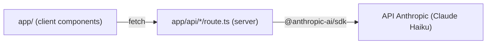

# Architecture Spine — Prompt Evaluator POC

## Design Paradigm

**Next.js App Router**, un seul projet pour le client et le serveur :

- `app/` (pages, composants React côté client) — l'UI, aucun appel LLM direct.
- `app/api/*/route.ts` (Route Handlers, exécutés côté serveur uniquement) — seule couche autorisée à appeler l'API Anthropic.

Le client appelle exclusivement ses propres routes API internes (`fetch("/api/...")`) ; jamais l'API Anthropic directement.

## Invariants & Rules



### AD-1 — Clé API jamais exposée côté client [ADOPTED]

- **Binds:** FR11, tout appel LLM
- **Prevents:** la clé Anthropic fuit dans le bundle client ou un composant `"use client"` appelle directement l'API Anthropic
- **Rule:** `@anthropic-ai/sdk` n'est importé et instancié que dans des fichiers `app/api/**/route.ts` (contexte serveur). `ANTHROPIC_API_KEY` n'est lu que via `process.env` côté serveur, jamais passé au client, jamais préfixé `NEXT_PUBLIC_`.

### AD-2 — Contrat des routes API [RÉVISÉ 2026-09-11]

- **Binds:** FR1–FR4, FR7, FR9, FR10
- **Prevents:** le front et les routes divergent sur le format des échanges
- **Rule:** exactement ces quatre routes, ces formes de requête/réponse :
  - `POST /api/extract-criteria` *(nouvelle)* : `{ prompt: string }` → `{ criteria: string[] }` — extrait uniquement les exigences vérifiables présentes dans le texte ; ne renvoie jamais les 3 critères fixes (ceux-ci n'existent que côté serveur, voir AD-2b).
  - `POST /api/execute` : `{ prompt: string }` → `{ output: string }` *(inchangée)*
  - `POST /api/score` : `{ output: string, criteria: string[] }` → `{ results: { criterion: string, passed: boolean, explanation: string }[] }` — `criteria` reçu du client contient uniquement les critères extraits (possiblement édités) ; les 3 critères fixes sont concaténés **côté serveur**, dans la route elle-même, avant l'appel Anthropic (voir AD-2b). Le client ne les envoie jamais et ne les voit jamais dans la réponse sous une forme qui les distinguerait des critères extraits — `results` peut contenir des entrées correspondant aux critères fixes, mais rien côté client n'affiche cette distinction (l'UI ne les affiche pas du tout individuellement, voir `EXPERIENCE.md.Foundation`).
  - `POST /api/analyze-dimensions` *(remplace `/api/analyze`)* : `{ prompt: string, responses?: string[], scoreResults?: { criterion: string, passed: boolean }[][] }` → `{ dimensions: { name: "objectif" | "contexte" | "contraintes", note: number, palier: "absent" | "a-clarifier" | "clair" | "tres-clair", explanation: string, rewriteSuggestion: string, correctionApplied: boolean, correctionDetail?: string }[] }` — `responses` (les N réponses générées) et `scoreResults` (résultats de `/api/score`, une entrée par réponse) alimentent la correction comportementale (AD-4b) : `responses` permet le jugement qualitatif de divergence (Objectif, Contexte — nécessite de lire le texte, pas seulement les verdicts), `scoreResults` permet le calcul déterministe du taux d'échec (Contraintes). **Correction 2026-09-11 (Story 2.2)** : `responses` a été ajouté au contrat initial, qui ne prévoyait que `scoreResults` — insuffisant pour juger une divergence de ton/angle sans le texte des réponses. Absent ou un seul élément (N=1) → `correctionApplied: false` sur toutes les dimensions.
  - Toute erreur (timeout, échec API) : `{ error: string }` + HTTP 500, sur les quatre routes — jamais de forme d'erreur spécifique à une route.

### AD-2b — Critères fixes injectés côté serveur, jamais transmis au client [NOUVEAU 2026-09-11]

- **Binds:** FR2b
- **Prevents:** les 3 critères fixes fuitent dans une requête/réponse réseau visible côté client, ou sont éditables comme les critères extraits
- **Rule:** la liste des 3 critères fixes (orthographe/grammaire, cohérence interne, même langue que le prompt) est une constante définie uniquement dans `app/api/score/route.ts` (ou un module serveur importé par cette route). Elle n'est jamais retournée par `/api/extract-criteria`, jamais acceptée en entrée d'aucune route, et jamais présente dans un payload envoyé au client.

### AD-3 — Exécutions et notations indépendantes, sans contexte partagé

- **Binds:** FR3, FR4
- **Prevents:** une route réutilise involontairement l'historique d'un appel précédent, biaisant la mesure des N exécutions indépendantes
- **Rule:** chaque appel à `/api/execute`, `/api/score` et `/api/extract-criteria` envoie un unique message à l'API Anthropic sans historique de conversation joint — un appel = un contexte neuf, aucun état conversationnel conservé côté serveur entre deux appels.

### AD-4 — Orchestration du flux côté client, échec = abandon complet [RÉVISÉ 2026-09-11]

- **Binds:** FR2, FR2a, FR3, FR3b, FR4, FR7, FR9
- **Prevents:** le client procède à la génération sans validation des critères, agrège un résultat sur un sous-ensemble de N réponses sans le signaler, ou une logique d'orchestration serveur apparaît en doublon de la boucle client
- **Rule:** le flux est orchestré côté client (`app/page.tsx`), pas par une route serveur agrégatrice, en **quatre phases séquentielles** :
  1. `POST /api/extract-criteria` (un appel) → ouverture de la liste éditable, **attente d'une action utilisateur** ("Confirmer et lancer" ou "Annuler" — ce dernier interrompt le flux sans erreur)
  2. Les N appels à `/api/execute`
  3. Les N appels à `/api/score` (chacun avec les critères extraits + fixes, AD-2b) — toutes les N exécutions doivent être produites avant que la notation ne commence (pas d'entrelacement exécution→notation répété N fois)
  4. Un appel à `/api/analyze-dimensions`, déclenché automatiquement dès que la phase 3 est terminée — pas au clic sur la bascule Réponses/Analyse, qui ne fait que changer l'affichage (`EXPERIENCE.md.Component Patterns`, "View toggle")

  N est choisi par l'utilisateur (1 à 10, défaut 5) et **figé au lancement** (phase 2) : les routes API restent sans état et ignorent N, chacune ne traitant qu'une exécution ou qu'une notation. Si un seul appel échoue (timeout, erreur API) à n'importe quelle étape des phases 2 à 4, le flux entier est abandonné et l'erreur affichée — jamais de résultat calculé sur un sous-ensemble.

### AD-4b — Seuils de correction comportementale [NOUVEAU 2026-09-11]

- **Binds:** FR9, FR10
- **Prevents:** le calcul de correction diverge entre dimensions ou entre appels, ou un seuil est réinterprété différemment à chaque notation
- **Rule:** `/api/analyze-dimensions` calcule la correction de chaque dimension selon ce barème fixe (3 niveaux, mêmes points pour les 3 dimensions) :
  - **Contraintes** : taux de réponses en défaut sur au moins un critère (fixe ou extrait), calculé en code à partir de `scoreResults` (déterministe, pas de jugement du modèle) → 0% = faible (-0), 1-33% = modérée (-2), >33% = forte (-4)
  - **Objectif** : divergence qualitative entre réponses sur le sujet/angle/niveau de détail, jugée par le modèle à partir du texte des `responses` → même barème faible/modérée/forte
  - **Contexte** : divergence qualitative entre réponses sur le ton, jugée par le modèle à partir du texte des `responses` → même barème faible/modérée/forte
  - La correction s'applique **avant** la traduction en palier (0 = Absent, 1-5 = À clarifier, 6-8 = Clair, 9-10 = Très clair). Si `responses`/`scoreResults` sont absents ou ne contiennent qu'un seul élément (N=1), `correctionApplied` est `false` sur les 3 dimensions et aucune correction n'est appliquée. `correctionApplied` n'est vrai que si la correction est non nulle (modérée ou forte) — une divergence faible (-0) n'est pas considérée comme "une correction appliquée".

### AD-5 — Pas de persistance, état 100% client

- **Binds:** tout l'état applicatif (prompt, critères extraits, réponses générées, notation par dimension)
- **Prevents:** ajout prématuré d'une base de données ou de `localStorage` alors que le POC ne l'exige pas (non-goal PRD)
- **Rule:** l'état vit uniquement en mémoire React (`useState`/`useReducer`) dans les composants client. Aucune écriture disque, aucun stockage navigateur, aucune base de données.

## Consistency Conventions

| Concern | Convention |
| --- | --- |
| Naming (fichiers, routes) | Routes API en kebab-case sous `app/api/<verbe>/route.ts` (`extract-criteria`, `execute`, `score`, `analyze-dimensions`) ; composants React en PascalCase |
| Data & formats | JSON uniquement en entrée/sortie des routes ; erreurs toujours `{ error: string }` + HTTP 500 (AD-2) |
| State & cross-cutting | Un seul point d'appel Anthropic par route (pas de fan-out caché) ; aucune variable d'environnement lue côté client ; critères fixes définis une seule fois, côté serveur (AD-2b) |
| Visual identity | Alignée sur SwoodQuest (app skill tree du cabinet) : police `Fraunces` (titres, via `next/font/google`) + `Geist`/`Geist Mono` (interface) ; couleurs en tokens CSS dans `app/globals.css` (`--primary: #851F6B`, `--background: #fdf6e9`, `--accent: #d99a2b`) — utiliser ces tokens (`bg-primary`, `text-foreground`, etc.), jamais une couleur en dur ; voir `DESIGN.md` (spine UX) pour le détail complet des tokens |

## Stack

| Name | Version |
| --- | --- |
| Next.js (App Router) | 16.3 |
| Node.js | ≥ 20.9 |
| React | bundlé avec Next.js 16.3 |
| Tailwind CSS | 4.3.3 |
| @anthropic-ai/sdk | 0.123.0 |
| Modèle Anthropic (extraction + exécution + notation + analyse) | Claude Haiku |
| Hébergement | Vercel |

## Structural Seed

```text
{root}/
  app/
    page.tsx                     # écran principal : prompt, liste de critères, réponses générées, analyse par dimension
    api/
      extract-criteria/route.ts  # POST -> appel Anthropic, extraction des critères du prompt
      execute/route.ts           # POST -> appel Anthropic, une exécution
      score/route.ts             # POST -> appel Anthropic, notation d'une exécution (critères extraits + fixes, AD-2b)
      analyze-dimensions/route.ts # POST -> appel Anthropic, notation par dimension + correction comportementale (AD-4b)
  package.json
  .env.local                     # ANTHROPIC_API_KEY (non commité)
```

### Déploiement & environnements

Un seul environnement : Vercel (`prompt-evaluator-v2-eight.vercel.app`, projet `prompt-evaluator-v2`). `ANTHROPIC_API_KEY` déclarée en variable d'environnement Vercel, jamais commitée. La connexion GitHub↔Vercel automatique n'est pas résolue pour ce repo (l'app Vercel n'a pas accès à l'organisation GitHub) — chaque déploiement se fait manuellement via `vercel --prod`. Pas de staging séparé.

## Capability → Architecture Map

| Capability / Area | Lives in | Governed by |
| --- | --- | --- |
| FR1 (saisie prompt) | `app/page.tsx` | AD-5 |
| FR2, FR2a (extraction + validation des critères) | `app/api/extract-criteria/route.ts` + `app/page.tsx` | AD-1, AD-2, AD-3, AD-4 |
| FR2b (critères fixes invisibles) | `app/api/score/route.ts` | AD-2b |
| FR3, FR3b (N exécutions, N réglable 1-10) | `app/api/execute/route.ts` + `app/page.tsx` | AD-1, AD-2, AD-3, AD-4 |
| FR4, FR7 (notation en arrière-plan + affichage des réponses) | `app/api/score/route.ts` + `app/page.tsx` | AD-1, AD-2, AD-2b, AD-3, AD-4, AD-5 |
| FR9, FR10 (notation par dimension + correction + détail pédagogique) | `app/api/analyze-dimensions/route.ts` | AD-1, AD-2, AD-4, AD-4b |
| FR11 (clé API sécurisée) | toutes les routes `app/api/**` | AD-1 |

## Deferred

- **Multi-utilisateurs / connexion / base de données** — non-goal du POC (PRD), à cadrer dans un futur PRD si le go est donné.
- **Multi-fournisseurs LLM, choix du modèle "réel"** — Future Considerations (P2) du PRD, hors altitude de ce spine POC.
- **Historique/persistance des évaluations** — dépend de la décision go/no-go, non tranché.
- **Affinage du seuil "Très clair" côté UI** — `DESIGN.md` note un `[ASSUMPTION]` sur le traitement visuel du 4ᵉ palier (teinte plus dense de la même couleur), à confirmer avant implémentation finale du composant de pastille de statut.
