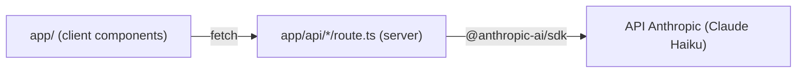

# Architecture Spine — Prompt Evaluator POC

## Design Paradigm

**Next.js App Router**, un seul projet pour le client et le serveur :

- `app/` (pages, composants React côté client) — l'UI, aucun appel LLM direct.
- `app/api/*/route.ts` (Route Handlers, exécutés côté serveur uniquement) — seule couche autorisée à appeler l'API Anthropic.

Le client appelle exclusivement ses propres routes API internes (`fetch("/api/...")`) ; jamais l'API Anthropic directement.

## Invariants & Rules



### AD-1 — Clé API jamais exposée côté client [ADOPTED]

- **Binds:** FR11, tout appel LLM
- **Prevents:** la clé Anthropic fuit dans le bundle client ou un composant `"use client"` appelle directement l'API Anthropic
- **Rule:** `@anthropic-ai/sdk` n'est importé et instancié que dans des fichiers `app/api/**/route.ts` (contexte serveur). `ANTHROPIC_API_KEY` n'est lu que via `process.env` côté serveur, jamais passé au client, jamais préfixé `NEXT_PUBLIC_`.

### AD-2 — Contrat des routes API

- **Binds:** FR1–FR10
- **Prevents:** le front et les routes divergent sur le format des échanges
- **Rule:** exactement ces trois routes, ces formes de requête/réponse :
  - `POST /api/execute` : `{ prompt: string }` → `{ output: string }`
  - `POST /api/score` : `{ output: string, criteria: string[] }` → `{ results: { criterion: string, passed: boolean, explanation: string }[] }`
  - `POST /api/analyze` : `{ prompt: string, runResults?: { criterion: string, passed: boolean }[][] }` → `{ dimensions: { name: "persona" | "objectif" | "contraintes" | "exemples", status: "présent" | "clair" | "absent", explanation: string, example: string }[] }`
  - Toute erreur (timeout, échec API) : `{ error: string }` + HTTP 500, sur les trois routes — jamais de forme d'erreur spécifique à une route.

### AD-3 — Exécutions et notations indépendantes, sans contexte partagé

- **Binds:** FR3, FR4
- **Prevents:** une route réutilise involontairement l'historique d'un appel précédent, biaisant la mesure des N exécutions indépendantes
- **Rule:** chaque appel à `/api/execute` et `/api/score` envoie un unique message à l'API Anthropic sans historique de conversation joint — un appel = un contexte neuf, aucun état conversationnel conservé côté serveur entre deux appels.

### AD-4 — Orchestration des N exécutions côté client, échec = abandon complet

- **Binds:** FR3, FR3b, FR4–FR7
- **Prevents:** le client moyenne un score sur moins de N exécutions sans le signaler, ou une logique d'orchestration serveur apparaît en doublon de la boucle client
- **Rule:** la boucle des N exécutions (`/api/execute` puis `/api/score`, répété N fois) est orchestrée côté client (`app/page.tsx`), pas par une route serveur agrégatrice. N est choisi par l'utilisateur (1 à 10, défaut 5) et **figé au lancement** : les routes API restent sans état et ignorent N, chacune ne traitant qu'une exécution. Si un seul appel échoue (timeout, erreur API) à n'importe quelle étape, l'évaluation entière est abandonnée et l'erreur affichée — jamais de moyenne calculée sur un sous-ensemble des N résultats.

### AD-5 — Pas de persistance, état 100% client

- **Binds:** tout l'état applicatif (prompt, critères, résultats d'exécution, analyse)
- **Prevents:** ajout prématuré d'une base de données ou de `localStorage` alors que le POC ne l'exige pas (non-goal PRD)
- **Rule:** l'état vit uniquement en mémoire React (`useState`/`useReducer`) dans les composants client. Aucune écriture disque, aucun stockage navigateur, aucune base de données.

## Consistency Conventions

| Concern | Convention |
| --- | --- |
| Naming (fichiers, routes) | Routes API en kebab-case sous `app/api/<verbe>/route.ts` (`execute`, `score`, `analyze`) ; composants React en PascalCase |
| Data & formats | JSON uniquement en entrée/sortie des routes ; erreurs toujours `{ error: string }` + HTTP 500 (AD-2) |
| State & cross-cutting | Un seul point d'appel Anthropic par route (pas de fan-out caché) ; aucune variable d'environnement lue côté client |
| Visual identity | Alignée sur SwoodQuest (app skill tree du cabinet) : police `Fraunces` (titres, via `next/font/google`) + `Geist`/`Geist Mono` (interface, déjà en place) ; couleurs en tokens CSS dans `app/globals.css` (`--primary: #851F6B`, `--background: #fdf6e9`, `--accent: #d99a2b`) — utiliser ces tokens (`bg-primary`, `text-foreground`, etc.), jamais une couleur en dur, pour que les écrans suivants restent visuellement cohérents |

## Stack

| Name | Version |
| --- | --- |
| Next.js (App Router) | 16.3 |
| Node.js | ≥ 20.9 |
| React | bundlé avec Next.js 16.3 |
| Tailwind CSS | 4.3.3 |
| @anthropic-ai/sdk | 0.123.0 |
| Modèle Anthropic (exécution + notation) | Claude Haiku |
| Hébergement | Vercel |

## Structural Seed

```text
{root}/
  app/
    page.tsx              # écran principal : saisie prompt + critères, résultats
    api/
      execute/route.ts    # POST -> appel Anthropic, une exécution
      score/route.ts      # POST -> appel Anthropic, notation d'une exécution
      analyze/route.ts    # POST -> appel Anthropic, analyse 4 dimensions
  package.json
  .env.local               # ANTHROPIC_API_KEY (non commité)
```

### Déploiement & environnements

Un seul environnement : Vercel (build depuis le repo GitHub à créer en tout début de développement). `ANTHROPIC_API_KEY` déclarée en variable d'environnement Vercel, jamais commitée. Pas de staging séparé — le délai de 3 jours ne le justifie pas.

## Capability → Architecture Map

| Capability / Area | Lives in | Governed by |
| --- | --- | --- |
| FR1–FR2 (saisie prompt + critères) | `app/page.tsx` | AD-5 |
| FR3, FR3b (N exécutions, N réglable 1-10) | `app/api/execute/route.ts` + `app/page.tsx` | AD-1, AD-2, AD-3, AD-4 |
| FR4–FR7 (notation + affichage) | `app/api/score/route.ts` + `app/page.tsx` | AD-1, AD-2, AD-3, AD-4, AD-5 |
| FR8–FR10 (analyse 4 dimensions) | `app/api/analyze/route.ts` | AD-1, AD-2 |
| FR11 (clé API sécurisée) | toutes les routes `app/api/**` | AD-1 |

## Deferred

- **Multi-utilisateurs / connexion / base de données** — non-goal du POC (PRD), à cadrer dans un futur PRD si le go est donné.
- **Multi-fournisseurs LLM, choix du modèle "réel"** — Future Considerations (P2) du PRD, hors altitude de ce spine POC. (N configurable ne figure plus ici : ramené dans le POC en FR3b, curseur 1-10, voir AD-4.)
- **Historique/persistance des évaluations** — dépend de la décision go/no-go, non tranché.
